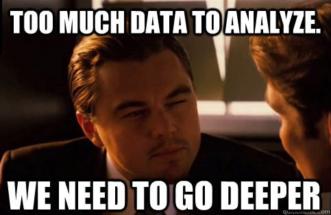
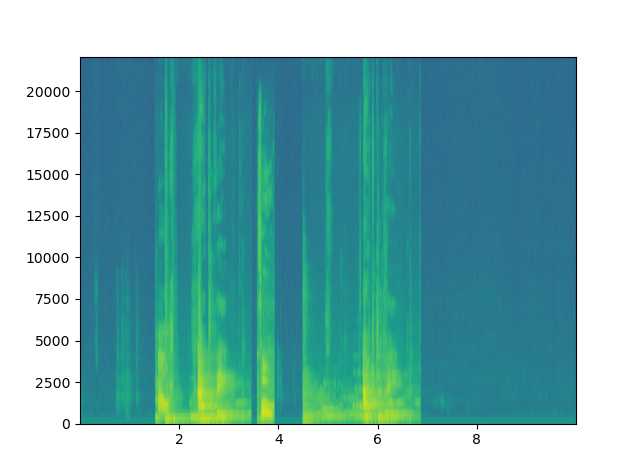
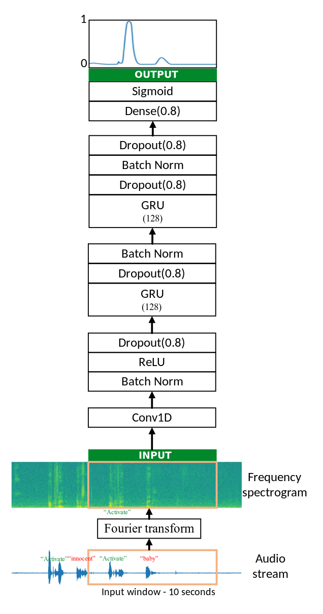
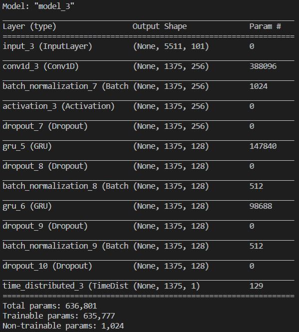
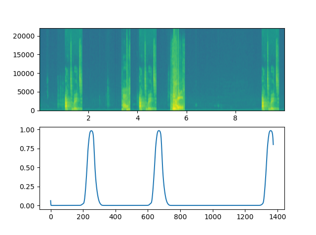
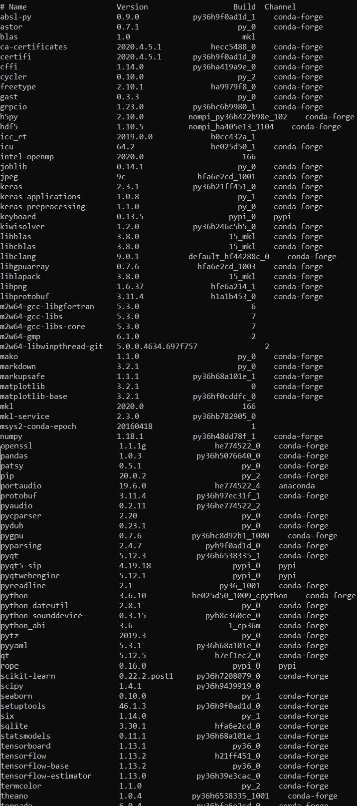

# Trigger-Word-Detection
---

## Introduction

<p align='center'>
  
</p>

- This implementation was inspired by the Deep Learning Specialization on Coursera by _Andrew Ng_.
- A trigger word is a word that you wake up a virtual voice assistant, for example “Ok Google”. 
- Trigger word detection works by listening to a stream of audio, and preprocessing it before sending it the model, which predicts whether the trigger word is there or not.
- We have trained our model for the trigger word **'activate'**.
---

## Sections

- [Data synthesis](#data-synthesis)
- [Data preprocessing](#data-preprocessing)
- [Model](#model)
- [Required Modules](#required-modules)
- [References](#references)

---

## [Data Synthesis](#sections)

> **Time to cook some data.**
<p align='center'>
  
</p>

- We have 3 types of audio recording.
  - Positives
  - Negatives
  - Backgrounds

- Positives are the trigger words on which we want our system to wake up.
- Negatives are the words on which our system should not respond.
- Backgrounds are the recordings of the noises present in different enviroments.
- To generate training data, we randomly pick audio from positives and negatives, and overlay them on the background noises.
---
## [Data Preprocessing](#sections)

> **Let's go deeper**.
<p align='center'>
  
</p>

- In an audio data we get the variation of the amplitude of variation in air pressure with respect to time. You can think of an audio recording as a long list of numbers measuring the little air pressure changes detected by the microphone.

- It is quite difficult to figure out from this "raw" representation of audio whether the word "activate" was said. In order to help our sequence model more easily learn to detect triggerwords, we will compute a spectrogram of the audio.

- Visual representation of frequencies of a given signal with time is called Spectrogram. In a spectrogram representation plot one axis represents the time, the second axis represents frequencies and the colors represent magnitude (amplitude) of the observed frequency at a particular time.

- Spectrogram of one of our training is shown below:

<p align='center'>
  
</p>

---

## [Model](#sections)

> **Let's have a look at our model.**
<p align='center'>
  
</p>

- The architecture of the model consists of 1-D convolutional layers, GRU layers, and dense layers.

- The bottom most layer is a 1D CONV layer which is similar to a convolutional layer used in image classification networks. It converts the input of length 5511 time steps into 1375.

- Conv layer is followed by batch normalization, activation and a drop-out layer.

- GRUs(Gated recurrent units) are improved version of standard recurrent neural network. GRU aims to solve the vanishing gradient problem which comes with a standard recurrent neural network.

- Let's view the summary of our model.

```python
model.summary()
```

<p align='center'>
  
</p>

- As you can see that our model has about 500K trainable parameters. It's gonna take a long time. To save time, a model is trained for about 3 hours on a GPU using the architecture you built above, and a large training set of about 4000 examples. This model is saved in the file 'model.h5'.

- We trained the model further, using the Adam optimizer and binary cross entropy loss with a small training set of 26 examples, which we created. This model is saved in the file 'model_trained.h5'.

- If we plot the spectrogram of the audio and the prediction values of our model we can see the peaks depecting the trigger word, like the one below.

<p align='center'>
  
</p>
  
---

## [Required Modules](#sections)

<p align='center'>
  
</p>

---

## [References](#sections)

- General guidance
  - [Introduction to how Alexa, Siri and Google wake up when you call their name](https://medium.com/x8-the-ai-community/ok-google-tell-me-how-trigger-word-detection-works-f6f877e2cd8b)
  - [Trigger Word Detection - Coursera](https://www.coursera.org/learn/nlp-sequence-models/lecture/Li4ts/trigger-word-detection)
  - [Chengwei Zhang's Keras Trigger Word repository](https://github.com/Tony607/Keras-Trigger-Word)

- Spectogram
  - [Spectogram implentation from scratch](https://fairyonice.github.io/implement-the-spectrogram-from-scratch-in-python.html)
  - [Discrete Fourier Transform, Part 1 by Steven Brunton](https://youtu.be/bhxDXab0ffg)
  - [Discrete Fourier Transform, Part 2 by Steven Brunton](https://youtu.be/PsEsMIPYJBg)
  - [Discrete Fourier Transform, Part 3 by Steven Brunton](https://youtu.be/Ktkm5KCryPw)
  - [matplotlib.pyplot.specgram](https://matplotlib.org/api/_as_gen/matplotlib.pyplot.specgram.html)
  - [Stackoverflow understanding parameters of specgram](https://stackoverflow.com/questions/29321696/what-is-a-spectrogram-and-how-do-i-set-its-parameters)

- Real Time Implementation
  - [SoundDevice Module](https://python-sounddevice.readthedocs.io/en/0.3.15/usage.html#playback)
  - [Keyboard Module](https://pypi.org/project/keyboard/)
