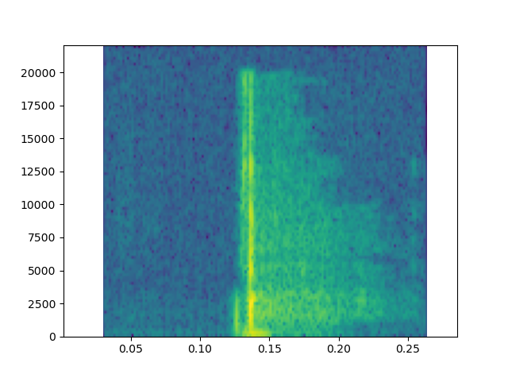

# Real-Time-Trigger-Word-Detection
---
### Spectrogram

  

---
## References

- General guidance
  - [Introduction to how Alexa, Siri and Google wake up when you call their name](https://medium.com/x8-the-ai-community/ok-google-tell-me-how-trigger-word-detection-works-f6f877e2cd8b)
  - [Trigger Word Detection - Coursera](https://www.coursera.org/learn/nlp-sequence-models/lecture/Li4ts/trigger-word-detection)
  - [Chengwei Zhang's Keras Trigger Word repository](https://github.com/Tony607/Keras-Trigger-Word)

- Spectogram
  - [Spectogram implentation from scratch](https://fairyonice.github.io/implement-the-spectrogram-from-scratch-in-python.html)
  - [Discrete Fourier Transform, Part 1 by Steven Brunton](https://youtu.be/bhxDXab0ffg)
  - [Discrete Fourier Transform, Part 2 by Steven Brunton](https://youtu.be/PsEsMIPYJBg)
  - [Discrete Fourier Transform, Part 3 by Steven Brunton](https://youtu.be/Ktkm5KCryPw)
  - [matplotlib.pyplot.specgram](https://matplotlib.org/api/_as_gen/matplotlib.pyplot.specgram.html)
  - [Stackoverflow understanding parameters of specgram](https://stackoverflow.com/questions/29321696/what-is-a-spectrogram-and-how-do-i-set-its-parameters)

- Real Time Implementation
  - [SoundDevice](https://python-sounddevice.readthedocs.io/en/0.3.15/usage.html#playback)